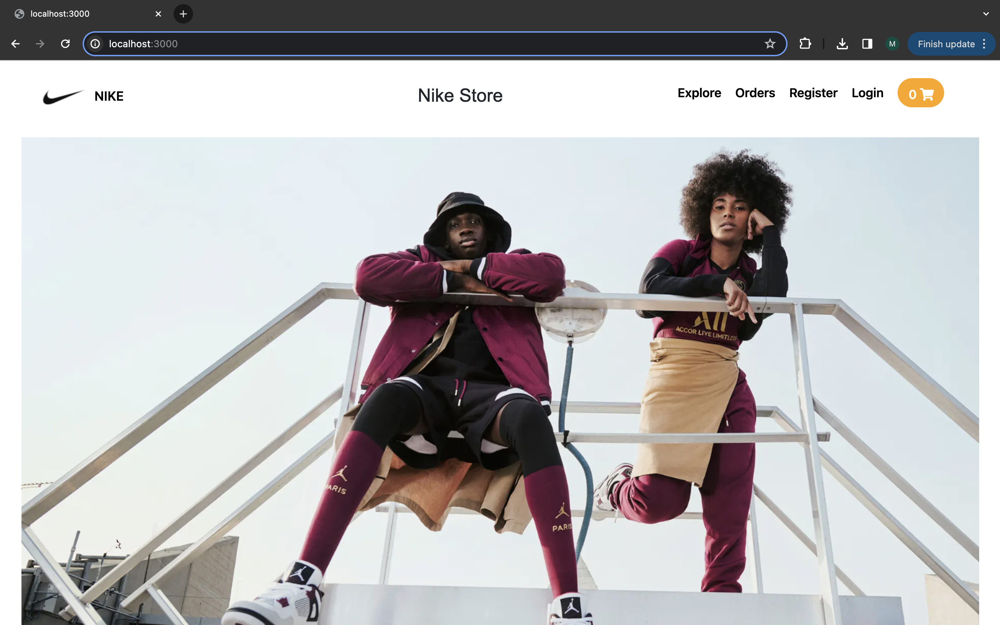

# Nike Shoe Store Website



## Overview

The Nike Shoe Store Website is a full-stack web application designed to provide users with a delightful shopping experience for Nike shoes. Users can register, log in, browse through the available shoe collection, add items to their cart, proceed to payment, and view their purchase history. The application also offers advanced filtering options based on size, gender, and other preferences.

## Technologies Used

- HTML
- CSS
- JavaScript
- Express.js
- MongoDB
- Node.js

## Dependencies

Make sure to install the following dependencies before running the application:

```json
"dependencies": {
  "axios": "^0.20.0",
  "bcrypt": "^5.0.0",
  "connect-mongo": "^3.2.0",
  "dotenv": "^8.2.0",
  "ejs": "^3.1.5",
  "express": "^4.17.1",
  "express-ejs-layouts": "^2.5.0",
  "express-flash": "0.0.2",
  "express-session": "^1.17.1",
  "moment": "^2.29.0",
  "mongoose": "^5.10.7",
  "nodemon": "^2.0.4",
  "noty": "^3.2.0-beta",
  "passport": "^0.4.1",
  "passport-local": "^1.0.0",
  "tailwindcss": "^1.8.10"
}

## Features

1. **User Authentication:**
   - Register and login to access personalized features.

2. **Shopping Cart:**
   - Add items to the cart and experience live interaction.

3. **Payment:**
   - Proceed to payment securely.

4. **Purchase History:**
   - View your past purchases.

5. **Advanced Filtering:**
   - Filter shoes based on size, gender, and other preferences.
